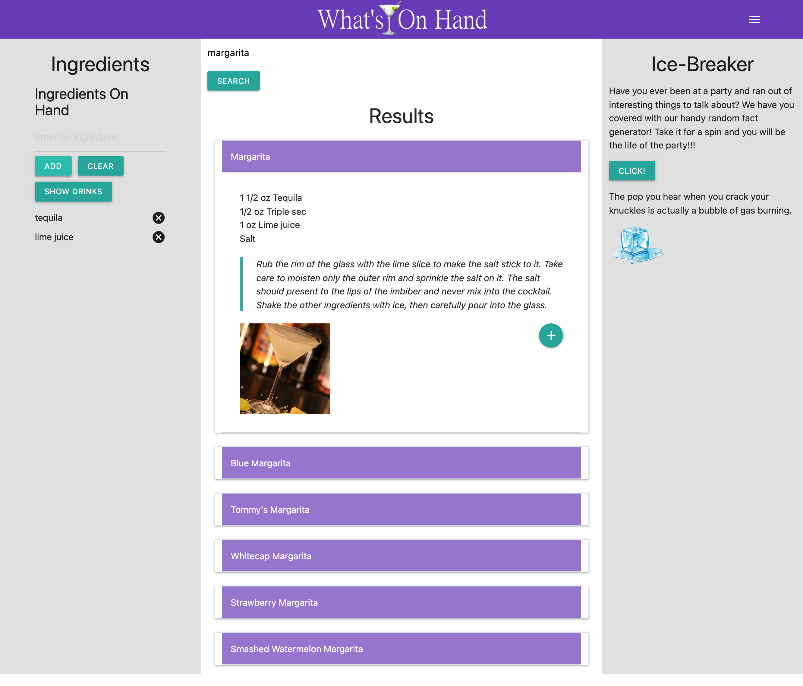

# What's On Hand
The beverage and knowledge builder!

## Description

This app is designed to provide beverage suggestions, based on user-input searches for drinks by name, or ingredients, as well as provide interesing trivia facts and conversation-starters.

We built this project for the purpose of practicing using the Materialize CSS Framework, creating/manipulating elements in the DOM via JavaScript and JQuery, utilizing API calls/response data, and saving/updating elements based on user inputs. This project is focused primarily on the following:
Styling elements for responsive design via Materialize.
Creating elements in the DOM via JavaScript and JQuery.
Utilizing API calls to retreive data.
Manipulating dynamically created elements to display data from an API call response.
Saving/accessing updates to Local Storage

This project can be found here:

## Contributors

taylorgehrts
Quagsire369
edwinalban

## Installation

N/A

## Usage

You may add ingredients to the list in the left column by entering an ingredient and clicking the add button. Once the ingredients have been added, you can click the show drinks button to view the possible drinks that can be made. Clicking on one of the drinks that is displayed will show its recipe, and instructions. Alternatively, you may search for a drink by name and click the search button to view a list of drinks that include the search criteria.

If you like a particular drink, you may click the pulsing + button after expanding the recipe to add it to the My Cocktails list for quick reference. The list is located in the upper right-hand corner of the page and can be accessed by clicking the menu icon.

The project can be used to practice styling pages via Materialize, and using JavaScript and JQuery for traversing the DOM, selecting elements in the DOM for manipulation, adding Event Listeners (specifically "click" and " events), running functions as a result of user clicks, making API calls, targeting specific data within an API response, setting strings to local storage, and retrieving objects from local storage.

